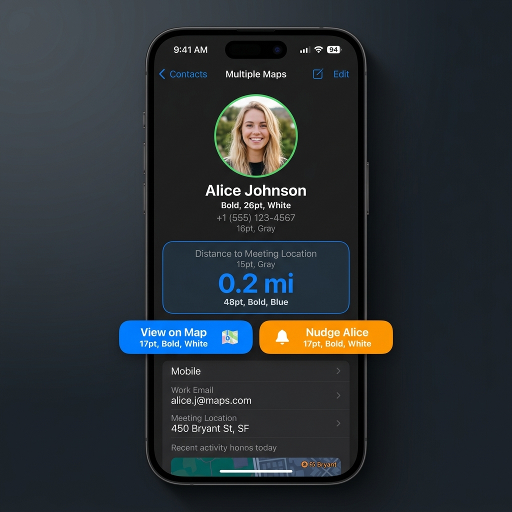

# 🗺️ Multiple Maps

Multiple Maps is a premium, highly-polished iOS application designed to revolutionize the way friends meet up. Send a single invite link, and effortlessly track everyone's real-time journey to a shared meeting location—all wrapped in a stunning, natively adaptive SwiftUI interface.

  
  
  

---

## ✨ Key Features

- **No-Download Web Fallback**: Seamlessly share meeting links. If a friend doesn't have the app installed, they are greeted by a beautiful web interface.
- **Aggressive Privacy Features**: Users are guaranteed safety with the "Sharing Active" banner, confirming that their location is strictly shared for only 2 hours, and solely with people possessing the unique invite link.
- **Adaptive Cross-Platform UI**: Engineered using `horizontalSizeClass`, the app elegantly scales across all Apple devices. 
  - On **iPhone**, it utilizes a fluid swipeable bottom sheet. 
  - On **iPad and Mac**, the UI intelligently transforms into a sleek, frosted glassmorphic floating sidebar, preserving edge-to-edge map immersion.
- **Engaging Micro-Interactions**:
  - Customize meeting destinations with fun, bouncy emojis (like 🍕 for your favorite pizzeria).
  - Profile avatars replace boring map pins and animate smoothly along their routes in real-time.
  - **"Nudge" Feature**: Send a haptic vibration and a toast notification to friends who are running late!

## 🚀 Getting Started

This repository is configured as a native **Swift Playgrounds App Package** (`.swiftpm`), meaning you do not need to deal with a bulky `.xcodeproj` structure.

### Prerequisites
- macOS Sonoma or later
- Xcode 15+ (with iOS 17.0 Simulator installed)

### Installation
1. Clone the repository to your local machine.
2. Double-click the `MultipleMaps.swiftpm` bundle.
3. Xcode will automatically open the project and resolve any necessary configurations.
4. Select an **iOS Simulator** (e.g., iPhone 15 Pro) or **My Mac (Designed for iPad)** from the top target menu.
5. Press `Cmd + R` (Run) to launch the app!

## 🛠️ Technology Stack
- **Framework**: SwiftUI (iOS 17+)
- **Map Integration**: MapKit (Native Apple Maps)
- **Architecture**: MVVM (Model-View-ViewModel)
- **Location Services**: CoreLocation

## 🤝 Contributing
Contributions, issues, and feature requests are welcome. Feel free to check the issues page if you want to contribute.

## 📄 License
This project is licensed under the MIT License - see the LICENSE file for details.
